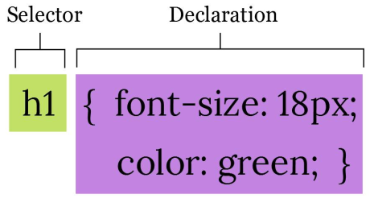
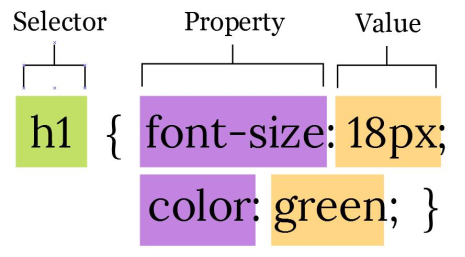
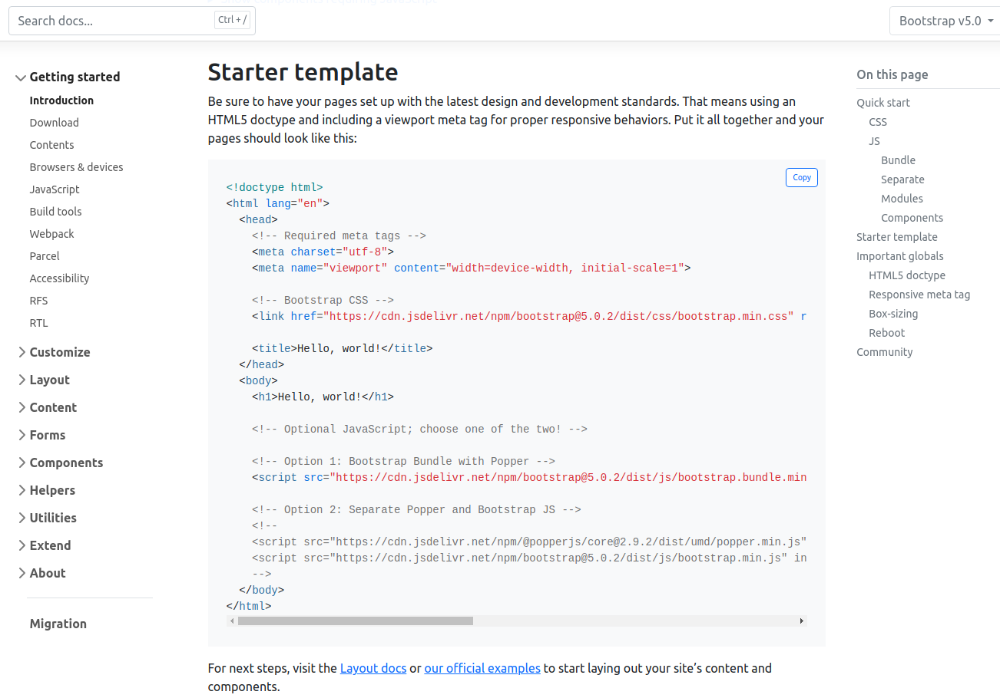
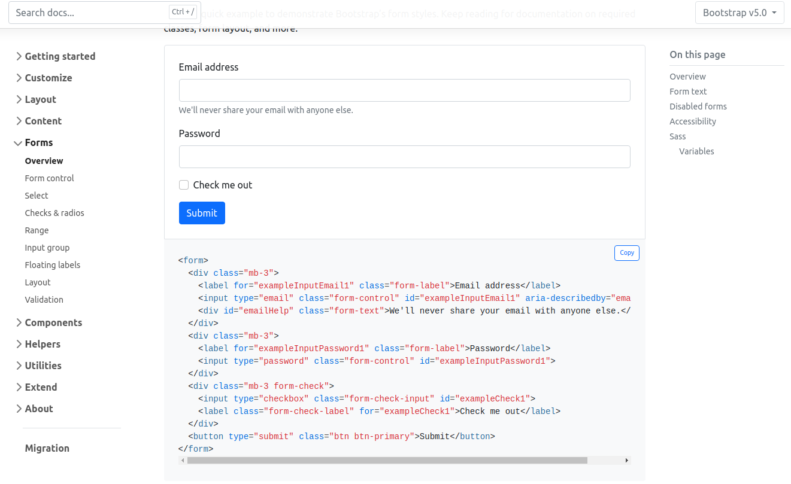

# Modul 1
# Pengantar CSS

Dosen Pengampu : **Arif Wicaksono Septyanto**

**Tujuan**:
- Mahasiswa mampu menerapkan dasar-dasar HTML dan dapat membuat struktur dasar halaman Web

**Materi**:
- CSS Selector
- List Element
- Image, Audio, Video Element
- Table Element
- Form Element

**Referensi**:
- HTML and CSS: The Comprehensive Guide


## Aturan Dasar Penulisan CSS
*Cascading Style Sheets* (CSS) digunakan untuk mengatur tampilan dan gaya elemen-elemen HTML di halaman web. Berikut adalah beberapa aturan dasar penulisan CSS:

- Selektor: Selektor adalah elemen HTML yang ingin Anda gayakan. Misalnya, jika Anda ingin mengubah tampilan semua paragraf di halaman, maka `<p>` adalah selektornya.
- Properti: Properti adalah atribut gaya yang ingin Anda terapkan pada elemen terpilih. Misalnya, untuk mengubah warna teks, properti yang digunakan adalah color.
- Nilai Properti: Setiap properti memiliki nilai yang dapat Anda atur. Misalnya, untuk properti color, nilai bisa berupa nama warna (seperti "red" atau "blue") atau kode warna (seperti `"#FF0000"` untuk merah).
- Deklarasi: Deklarasi adalah kombinasi dari properti dan nilai yang diterapkan pada selektor. Deklarasi ini ditempatkan di dalam blok gaya yang diapit oleh tanda kurung kurawal {}.

Contoh aturan dasar penulisan CSS:

```css
/* Selektor: Mengubah semua paragraf */
p {
  color: blue;
  font-size: 16px;
  margin: 10px;
}

/* Selektor: Mengubah elemen dengan class "highlight" */
.highlight {
  background-color: yellow;
  border: 1px solid black;
}

/* Selektor: Mengubah elemen dengan id "header" */
#header {
  text-align: center;
  font-size: 24px;
}
```
Dalam contoh di atas, Anda melihat penggunaan selektor seperti p, .highlight, dan #header. Setiap selektor diikuti oleh blok deklarasi yang berisi properti dan nilai yang ingin Anda terapkan pada elemen yang dipilih.

Beberapa aturan dasar tambahan yang perlu diingat:

1. Spasi dan Indentasi: Gunakan spasi atau tab untuk mengindentasi kode agar lebih mudah dibaca. Ini tidak mempengaruhi tampilan tetapi membuat kode lebih terstruktur.
2. Komentar: Anda dapat menambahkan komentar di CSS dengan menggunakan tanda /* komentar */. Komentar ini akan diabaikan oleh browser dan hanya berfungsi untuk keperluan dokumentasi.
3. Case Sensitivity: CSS bersifat case-insensitive untuk nama elemen dan atribut, tetapi case-sensitive untuk nama kelas, id, serta nama properti dan nilai.
4. Kaskade: Jika ada beberapa aturan CSS yang diterapkan pada elemen yang sama, maka aturan yang lebih spesifik atau yang terakhir dideklarasikan akan digunakan.
5. Unit: Nilai-nilai seperti ukuran font atau lebar harus diberikan dalam unit yang sesuai seperti px, em, rem, %, dll.

Ini hanya gambaran umum tentang aturan dasar penulisan CSS. Saat Anda memahami lebih banyak konsep dan fitur CSS, Anda dapat membuat gaya yang lebih kompleks dan sesuai dengan desain yang diinginkan.

<div align="center">
  
</div>

<div align="center">
  
</div>

## CSS Selector
CSS Selector adalah cara untuk memilih dan menargetkan elemen-elemen HTML tertentu pada halaman web sehingga Anda dapat menerapkan gaya atau aturan tertentu pada elemen-elemen tersebut. Selektor ini berperan penting dalam mendefinisikan bagaimana elemen-elemen HTML akan ditampilkan di halaman web.

Berikut adalah beberapa poin penting terkait CSS Selector:

1. Type Selector:
Menggunakan jenis elemen sebagai selektor. Contoh:

```css
p {
    color: blue;
}
```
    Ini akan menerapkan warna teks biru pada semua elemen ``<p>`` di halaman.

2. Class Selector:
Menggunakan atribut class sebagai selektor. Contoh HTML:
```css
    <p class="highlight">This is a highlighted paragraph.</p>
```

contoh css

```css
.highlight {
background-color: yellow;
}
```
Ini akan memberikan latar belakang warna kuning pada semua elemen dengan class "highlight".

3. ID Selector:
Menggunakan atribut ID sebagai selektor.

Contoh HTML:
```css
<h1 id="main-heading">Welcome to our website</h1>
```

Contoh CSS:

    ```css
    #main-heading {
        font-size: 24px;
    }
    ```
    Ini akan mengubah ukuran font menjadi 24px pada elemen dengan ID "main-heading".

4. Descendant Selector:
Memilih elemen yang merupakan turunan dari elemen lain.

Contoh HTML:
    ```css
    <ul>
        <li>Item 1</li>
        <li>Item 2</li>
    </ul>
    ```
Contoh CSS:
    ```css
    ul li {
        list-style-type: square;
    }
    ```
    Ini akan mengubah jenis bullet pada elemen `<li>` yang berada dalam elemen `<ul>`.

5. Pseudo-classes:
Menggunakan keadaan atau interaksi untuk memilih elemen.

Contoh:

    ```css
    a:hover {
        color: red;
    }
    ```
Ini akan mengubah warna teks menjadi merah saat pengguna mengarahkan kursor pada tautan.
    <div align="center">
    
    </div>

Contoh CSS:
    ```css
    div > p {
        font-style: italic;
    }
    ```
    Ini akan miringkan (italic) semua elemen `<p>` yang merupakan anak langsung dari elemen `<div>`.

7. Attribute Selector:
Memilih elemen berdasarkan atribut tertentu.

Contoh HTML:
    ```html
    <input type="submit" value="Submit">
    <input type="text" placeholder="Enter your name">
    ```
Contoh CSS:

    ```css
    [type="submit"] {
        background-color: green;
    }
    ```
Ini akan memberikan latar belakang warna hijau pada elemen dengan atribut type="submit".

8. Grouping Selector:
Menggabungkan beberapa selektor menjadi satu aturan.

Contoh:
```css
h1, h2, h3 {
color: purple;
}
```
Ini akan memberikan warna ungu pada semua elemen `<h1>`, `<h2>`, dan `<h3>`.

Semua contoh di atas menggambarkan cara CSS Selector digunakan untuk memilih elemen-elemen tertentu pada halaman web dan menerapkan gaya atau aturan tertentu pada elemen-elemen tersebut.

## Cascade, Inheritance dan Specificity
*Cascade*, *Inheritance*, dan *Specificity* adalah tiga konsep fundamental dalam CSS yang membantu dalam memahami bagaimana aturan-aturan gaya diterapkan pada elemen-elemen dalam halaman web. Mari jelaskan ketiga konsep tersebut lebih detail:

1. Cascade:
Cascade (urutan aplikasi aturan) mengacu pada cara CSS menangani konflik ketika ada aturan yang bertentangan atau tumpang tindih pada elemen yang sama. Urutan cascade ini penting untuk menentukan gaya mana yang akan diterapkan pada elemen tertentu.

Aturan cascade berjalan dalam tiga tingkatan:

   - Inline Styles: Gaya yang dideklarasikan secara langsung dalam atribut style pada elemen.
   - Internal Stylesheet: Gaya yang dideklarasikan dalam elemen `<style>`di dalam dokumen HTML.
   - External Stylesheet: Gaya yang dideklarasikan dalam file terpisah (CSS eksternal) yang dihubungkan dengan elemen `<link>`.
Ketika ada konflik, aturan yang memiliki tingkat cascade yang lebih tinggi akan mengatasi aturan yang memiliki tingkat lebih rendah. Misalnya, gaya dalam inline styles akan memiliki prioritas lebih tinggi daripada gaya dalam internal atau external stylesheet.

2. Inheritance:
*Inheritance* (pewarisan) merujuk pada konsep di mana beberapa properti gaya dari elemen anak dapat diwarisi dari elemen induknya. Ini memungkinkan elemen anak mengambil beberapa properti gaya dari elemen induk tanpa harus mendeklarasikan ulang.

Properti-properti seperti font-family, color, dan text-align cenderung diwarisi oleh elemen anak dari elemen induknya. Namun, properti seperti border dan width biasanya tidak diwarisi.

3. Specificity:
*Specificity* (kekhuan) mengukur sejauh mana sebuah selektor memiliki kekhususan dalam memilih elemen. Ketika ada konflik antara beberapa aturan yang berlaku pada elemen yang sama, specificity digunakan untuk menentukan aturan mana yang akan diterapkan.

Specificity diukur dalam nilai numerik yang terkait dengan jenis selektor dan penggunaan selektor tertentu (kelas, ID, elemen). Semakin tinggi nilai specificity, semakin kuat selektor tersebut.

Contoh tingkatan specificity:

- Inline styles memiliki nilai specificity tertinggi.
- ID selectors memiliki nilai lebih tinggi daripada class selectors atau type selectors.
- Pseudo-class selectors memiliki nilai lebih rendah daripada class selectors.
- Universal selectors memiliki nilai sangat rendah.

Menggabungkan pemahaman tentang Cascade, Inheritance, dan Specificity membantu dalam mengelola bagaimana gaya diterapkan pada elemen-elemen dalam halaman web dan mengatasi potensi konflik atau tumpang tindih aturan gaya.

contoh untuk setiap konsep tersebut:

1. Cascade:
HTML:
```html
<p class="red-text">This is a paragraph with a class.</p>
```
CSS (inline styles):

```css
<p style="color: blue;">This paragraph has inline styles.</p>
```

CSS (internal stylesheet):

```css
<style>
p {
    color: green;
}
</style>
```
CSS (external stylesheet):

```css
p {
    color: red;
}
```
Dalam contoh ini, meskipun ada beberapa aturan yang mempengaruhi elemen `<p>`, aturan yang diaplikasikan akan bergantung pada urutan cascade. Aturan dari inline styles akan memiliki prioritas tertinggi, diikuti oleh aturan dalam internal stylesheet dan external stylesheet.

2. Inheritance:

HTML:
```html
<div class="parent">
<p>This is a paragraph inside a parent div.</p>
</div>
```
CSS:

```css
.parent {
font-family: Arial, sans-serif;
color: blue;
}
```

Dalam contoh ini, elemen paragraf (`<p>`) akan mewarisi properti font-family dan color dari elemen induk (`<div class="parent">`). Itu berarti paragraf akan menggunakan font dan warna yang sama dengan div induknya.

3. Specificity:
HTML:
```html
<p class="special" id="unique">This is a specific paragraph.</p>
```
CSS:
```css
p {
color: red;
}

.special {
color: blue;
}

#unique {
color: green;
}
```
Dalam contoh ini, meskipun semuanya adalah elemen paragraf (`<p>`), properti color yang akan diterapkan pada elemen tersebut akan bergantung pada nilai specificity dari selektor. Selektor #unique memiliki specificity tertinggi, sehingga warna hijau akan diterapkan pada paragraf tersebut, meskipun ada aturan lain yang juga mempengaruhinya.


## CSS Typography
CSS Typography adalah bagian penting dari desain web yang berkaitan dengan tampilan dan pengaturan teks pada halaman web. Ini melibatkan penggunaan properti gaya untuk mengontrol jenis huruf, ukuran, warna, jarak, dan tata letak teks agar konten menjadi lebih mudah dibaca dan menarik bagi pengguna. Berikut ini beberapa properti dan konsep yang terkait dengan CSS Typography:

1. Font Family:
Properti ini mengatur jenis huruf yang akan digunakan untuk teks. Anda dapat menentukan beberapa jenis huruf sebagai alternatif jika jenis huruf pertama tidak tersedia di komputer pengguna.

Contoh:
```css
body {
    font-family: "Helvetica Neue", Arial, sans-serif;
}
```
2. Font Size:
Properti ini mengatur ukuran huruf teks. Ukuran biasanya dinyatakan dalam piksel (px), em, atau rem.

Contoh:
```css
p {
    font-size: 16px;
}
```

3. Font Weight:
Properti ini mengatur tebal tipografi. Anda dapat menggunakan nilai seperti normal, bold, atau angka numerik seperti 400 atau 700.

Contoh:
```css
h1 {
    font-weight: bold;
}
```

4. Font Style:
Properti ini mengatur gaya tipografi seperti miring (italic).

Contoh:
```css
em {
    font-style: italic;
}
```
5. Text Color:
Properti ini mengatur warna teks.

Contoh:
```css
h2 {
    color: #333333;
}
```
6. Text Alignment:
Properti ini mengatur penyejajaran teks, seperti rata kanan, rata kiri, rata tengah, atau rata kanan-kiri (justify).

Contoh:
```css
p {
    text-align: center;
}
```

7. Line Height:
Properti ini mengatur jarak antara baris dalam teks, sehingga mempengaruhi keterbacaan dan tata letak teks.

Contoh:
```css
p {
    line-height: 1.5;
}
```

8. Letter Spacing:
Properti ini mengatur jarak antara huruf dalam kata.

Contoh:

```css
h3 {
    letter-spacing: 1px;
}
```

9. Text Decoration:
Properti ini mengatur dekorasi teks seperti garis bawah (underline) atau garis tengah (line-through) untuk tautan atau teks terpilih.

Contoh:

```css
a {
     text-decoration: none;
}
```

10. Text Transform:
Properti ini mengatur perubahan gaya huruf dalam teks, seperti mengubah teks menjadi huruf kapital (uppercase) atau huruf kecil (lowercase).

Contoh:

```css
.uppercase {
    text-transform: uppercase;
}
```

CSS Typography membantu dalam menciptakan tampilan teks yang lebih menarik, mudah dibaca, dan sesuai dengan desain keseluruhan dari halaman web Anda.

## CSS Box Model

CSS Box Model adalah konsep dasar dalam desain tata letak halaman web yang menggambarkan bagaimana elemen HTML diatur dalam suatu halaman. Setiap elemen HTML dianggap sebagai sebuah "kotak" yang terdiri dari beberapa bagian, seperti konten, padding, border, dan margin. Konsep ini penting untuk memahami bagaimana elemen-elemen tersebut berinteraksi dan berdampingan dalam tata letak halaman.

CSS Box Model terdiri dari empat komponen utama:

1. Konten (Content): Ini adalah bagian dalam elemen yang berisi isi sebenarnya, seperti teks, gambar, atau elemen lainnya. Lebar dan tinggi konten diukur menggunakan properti width dan height.
2. Padding: Ini adalah ruang kosong yang ada di sekitar konten elemen. Padding memberikan jarak antara konten elemen dan batas internalnya (border). Padding juga dapat diatur menggunakan properti padding.
3. Border: Ini adalah garis yang mengelilingi elemen dan memisahkan antara konten, padding, dan elemen lainnya. Border dapat memiliki ketebalan, jenis garis, dan warna yang berbeda. Properti border digunakan untuk mengatur atribut-atribut ini.
4. Margin: Ini adalah ruang kosong yang ada di sekitar elemen, di luar border. Margin memberikan jarak antara elemen dan elemen-elemen lainnya dalam tata letak halaman. Properti margin digunakan untuk mengatur margin.

Berikut adalah ilustrasi lebih rinci tentang CSS Box Model:

```lua
+-----------------------------+
|          Margin             |
|                             |
|    +-------------------+    |
|    |      Border       |    |
|    |                   |    |
|    |   +-----------+   |    |
|    |   |  Padding  |   |    |
|    |   |           |   |    |
|    |   |  Content  |   |    |
|    |   |           |   |    |
|    |   +-----------+   |    |
|    |                   |    |
|    +-------------------+    |
|                             |
+-----------------------------+
```
Penting untuk diingat bahwa lebar dan tinggi elemen HTML sebenarnya mengacu pada dimensi konten. Padding, border, dan margin ditambahkan ke dimensi ini untuk menciptakan total lebar dan tinggi elemen.

Untuk mengontrol CSS Box Model, Anda dapat menggunakan properti seperti width, height, padding, border, dan margin dalam gaya CSS. Dengan memahami konsep ini, Anda dapat menghasilkan tata letak halaman web yang lebih baik dan lebih terorganisir.

contoh sederhana untuk mengilustrasikan konsep CSS Box Model:

Misalkan kita memiliki elemen `<div>` dalam HTML dengan teks di dalamnya, dan kita ingin mengatur padding, border, dan margin untuk elemen ini menggunakan CSS.

HTML:

```html
<!DOCTYPE html>
<html>
<head>
  <link rel="stylesheet" type="text/css" href="styles.css">
</head>
<body>
  <div class="box">
    Ini adalah teks dalam elemen div.
  </div>
</body>
</html>
```

CSS (styles.css):
```css
.box {
  width: 200px;
  height: 100px;
  padding: 20px;
  border: 2px solid blue;
  margin: 30px;
}
```

Dalam contoh di atas:

- Kami membuat sebuah elemen `<div>` dengan kelas box.
- Di dalam elemen `<style>` di `<head>`, kami menyisipkan file CSS eksternal yang berisi gaya untuk elemen dengan kelas box
- Kami mengatur dimensi elemen dengan properti width dan height.
- Kami memberikan padding sebesar 20px menggunakan properti padding.
- Kami memberikan border sebesar 2px dengan garis solid biru menggunakan properti border
- Kami memberikan margin sebesar 30px menggunakan properti margin.

Hasilnya akan seperti ini:
```scss
+---------------------------------------------+
|                Margin (30px)                |
|                                             |
|    +-----------------------------+          |
|    |       Border (2px solid blue) |          |
|    |                             |          |
|    |      Padding (20px)         |          |
|    |                             |          |
|    |  +-----------------------+  |          |
|    |  |                       |  |          |
|    |  |      Content          |  |          |
|    |  |                       |  |          |
|    |  +-----------------------+  |          |
|    |                             |          |
|    +-----------------------------+          |
|                                             |
+---------------------------------------------+

```
Seperti yang dapat Anda lihat, padding menambahkan jarak antara konten dan border, sedangkan margin menambahkan jarak antara elemen ini dengan elemen-elemen sekitarnya. Ini adalah ilustrasi sederhana tentang konsep CSS Box Model dalam tata letak elemen di halaman web.


## CSS Background

CSS background adalah properti yang digunakan untuk mengatur latar belakang elemen HTML. Properti ini memungkinkan Anda untuk mengubah warna latar belakang, menambahkan gambar, mengatur ukuran gambar, mengulang gambar, dan mengatur posisi gambar latar belakang. CSS background memiliki beberapa sub-properti yang dapat digunakan untuk mengontrol berbagai aspek latar belakang elemen.

Berikut adalah penjelasan detail tentang beberapa sub-properti CSS background:

1. background-color: Properti ini digunakan untuk mengatur warna latar belakang elemen. Anda dapat menggunakan nilai warna dalam format heksadesimal, RGB, atau nama warna.

Contoh:
```css
.element {
background-color: #FFA500; /* Warna oranye */
}
```

2. background-image: Properti ini digunakan untuk menambahkan gambar latar belakang ke elemen. Anda dapat menyediakan URL gambar sebagai nilai properti ini.

Contoh:
```css
.element {
background-image: url('gambar.jpg');
}
```

3. background-repeat: Properti ini mengontrol bagaimana gambar latar belakang diulang pada elemen. Nilai yang umum digunakan adalah repeat (mengulang horizontal dan vertikal), repeat-x (hanya mengulang horizontal), repeat-y (hanya mengulang vertikal), dan no-repeat (tidak mengulang).

Contoh:

```css
.element {
background-image: url('gambar.jpg');
background-repeat: repeat-x;
}
```

4. background-size: Properti ini mengontrol ukuran gambar latar belakang. Anda dapat mengatur nilai dalam bentuk persentase, piksel, atau kata kunci seperti cover (untuk mengisi elemen dengan gambar) atau contain (untuk memastikan seluruh gambar masuk ke dalam elemen).

Contoh:
```css
.element {
background-image: url('gambar.jpg');
background-size: cover;
}
```

5. background-position: Properti ini mengatur posisi gambar latar belakang di dalam elemen. Anda dapat menggunakan nilai dalam format horizontal dan vertikal (misalnya left top, center center, right bottom, dsb.).

Contoh:
```css
.element {
background-image: url('gambar.jpg');
background-position: center center;
}
```
6. background-attachment: Properti ini mengontrol apakah gambar latar belakang akan tetap berada di posisi tetap saat elemen digulir (scroll) atau tetap pada posisi tetap saat elemen digulir (fixed).

Contoh:
```css
.element {
background-image: url('gambar.jpg');
background-attachment: fixed;
}
```

Contoh penggunaan beberapa properti CSS background dalam satu elemen:
```css
.element {
background-color: #EFEFEF;
background-image: url('gambar.jpg');
background-repeat: no-repeat;
background-size: cover;
background-position: center center;
background-attachment: fixed;
}
```
Dengan memanfaatkan sub-properti CSS background, Anda dapat mengubah latar belakang elemen sesuai kebutuhan desain Anda, baik itu dengan warna, gambar, atau kombinasi keduanya.

Contoh kasus penggunaan properti CSS background dalam desain tata letak halaman web:

Kasus: Membuat Header dengan Latar Belakang Gambar dan Teks Tumpang Tindih

Misalkan Anda ingin membuat header pada halaman web Anda dengan latar belakang gambar dan teks yang tumpang tindih di atas gambar. Anda ingin gambar latar belakang mengisi seluruh area header dan teks tampil di tengah header.

HTML:
```html
<!DOCTYPE html>
<html>
<head>
  <link rel="stylesheet" type="text/css" href="styles.css">
</head>
<body>
  <header class="header">
    <h1>Welcome to Our Website</h1>
    <p>Discover Amazing Content</p>
  </header>
</body>
</html>
```
CSS (styles.css):

```css
.header {
  background-image: url('header-bg.jpg');
  background-size: cover;
  background-position: center center;
  background-attachment: fixed;
  color: white;
  text-align: center;
  padding: 100px 0;
}
```
Dalam contoh di atas:

- Kami menggunakan elemen `<header>` untuk mengelompokkan elemen header.
- Dalam file CSS, kami mengatur gambar latar belakang dengan properti background-image, ukuran dengan background-size, posisi dengan background-position, dan efek scroll tetap dengan background-attachment.
- Kami mengatur warna teks menjadi putih dengan properti color dan mengatur tata letak teks menjadi pusat dengan properti text-align.
- Kami memberikan ruang padding di atas dan bawah elemen header untuk menciptakan ruang di antara teks dan batas elemen.
- Hasilnya akan menjadi header dengan latar belakang gambar yang menarik dan teks yang tumpang tindih di tengah gambar latar belakang.

Anda dapat memodifikasi nilai-nilai properti seperti background-image, color, padding, dan lainnya sesuai dengan desain dan gambar yang Anda miliki.


## CSS Positioning

CSS Positioning adalah teknik yang digunakan dalam desain tata letak halaman web untuk mengontrol posisi elemen-elemen HTML. Dengan menggunakan properti position dan properti terkait, Anda dapat menentukan bagaimana elemen-elemen tersebut ditempatkan dalam halaman web.

Ada beberapa nilai yang dapat digunakan untuk properti position:

1. static (Default): Ini adalah nilai default untuk semua elemen. Elemen dengan position: static akan mengikuti aliran dokumen biasa dan tidak akan diubah posisinya oleh properti positioning lainnya.
2. relative: Elemen dengan position: relative tetap dalam aliran dokumen normal, tetapi Anda dapat menggunakan properti top, right, bottom, dan left untuk menggeser elemen tersebut dari posisi normalnya. Elemen-elemen lain tidak akan terpengaruh dan masih mengikuti aliran dokumen.
3. absolute: Elemen dengan position: absolute dikeluarkan dari aliran dokumen normal dan ditempatkan relatif terhadap elemen yang memiliki posisi non-static (default). Elemen tersebut akan diposisikan dengan menggunakan properti top, right, bottom, dan left relatif terhadap elemen yang memiliki posisi terdekat.
4. fixed: Elemen dengan position: fixed juga dikeluarkan dari aliran dokumen normal dan tetap pada posisi tertentu di layar, bahkan saat halaman digulir. Properti top, right, bottom, dan left digunakan untuk menentukan posisi elemen tersebut di dalam tampilan.
5. sticky: Nilai position: sticky menggabungkan sifat relative dan fixed. Elemen akan berperilaku seperti elemen relative sampai mencapai batas tertentu pada jendela tampilan, kemudian elemen tersebut akan berperilaku seperti fixed.

Contoh penggunaan properti CSS position:
```css
.relative-example {
  position: relative;
  top: 20px;
  left: 30px;
}

.absolute-example {
  position: absolute;
  top: 50px;
  left: 50px;
}

.fixed-example {
  position: fixed;
  top: 20px;
  right: 20px;
}

.sticky-example {
  position: sticky;
  top: 10px;
}
```
Dalam contoh di atas:

- relative-example memiliki posisi relatif dan diangkat 20px dari atas dan 30px dari kiri
- absolute-example memiliki posisi absolut dengan jarak 50px dari atas dan 50px dari kiri
- fixed-example memiliki posisi tetap pada posisi 20px dari atas dan 20px dari kanan layar
- sticky-example memiliki posisi sticky dan akan tetap pada posisi 10px dari atas hingga mencapai batas tertentu.

Penggunaan yang tepat dari properti position akan membantu Anda mengatur tata letak elemen-elemen pada halaman web sesuai dengan kebutuhan desain Anda.

## CSS3 Multiple Column

CSS3 Multiple Column Layout adalah fitur CSS yang memungkinkan Anda untuk membagi konten teks menjadi beberapa kolom yang rapi, mirip dengan tata letak surat kabar atau majalah. Fitur ini sangat berguna untuk meningkatkan pembacaan pada layar yang lebih lebar dan menghindari pembacaan berbaris panjang yang sulit diikuti. Dengan menggunakan column-count, column-width, dan properti terkait, Anda dapat mengatur jumlah kolom dan lebar kolom yang diinginkan.

Berikut adalah penjelasan lebih rinci tentang properti-properti yang digunakan dalam CSS3 Multiple Column Layout:

1. column-count: Properti ini mengatur jumlah kolom yang ingin ditampilkan dalam konten. Anda dapat mengaturnya dalam angka atau menggunakan kata kunci auto, yang membiarkan browser menentukan jumlah kolom terbaik berdasarkan lebar konten dan area tampilan.
2. column-width: Properti ini mengatur lebar setiap kolom. Anda dapat menggunakan nilai dalam satuan seperti piksel atau persentase.
3. column-gap: Properti ini mengatur jarak antara kolom-kolom. Anda dapat menggunakan nilai dalam satuan seperti piksel.
4. column-rule: Properti ini mengatur garis pemisah antara kolom-kolom. Anda dapat mengatur ketebalan, jenis garis, dan warna menggunakan nilai yang sesuai.
5. column-rule-width: Properti ini mengatur ketebalan garis pemisah kolom.
6. column-rule-style: Properti ini mengatur jenis garis pemisah kolom, seperti solid, dashed, atau dotted.
7. column-rule-color: Properti ini mengatur warna garis pemisah kolom.
8. column-span: Properti ini mengatur elemen yang akan merentangkan lebih dari satu kolom. Nilai all digunakan untuk merentangkan elemen di semua kolom.
9. Contoh penggunaan properti CSS3 Multiple Column Layout:

```css
.column-container {
  column-count: 3;
  column-width: 200px;
  column-gap: 20px;
  column-rule: 1px solid #ccc;
  column-span: all;
}
```
Dalam contoh di atas:

- column-container memiliki tiga kolom dengan lebar 200px masing-masing.
- Kolom memiliki jarak 20px di antara mereka dan dipisahkan oleh garis pemisah 1px solid berwarna abu-abu.
- Elemen dengan kelas .column-container akan merentangkan semua kolom.
Hasilnya akan menjadi konten yang terbagi menjadi tiga kolom dengan lebar dan tata letak yang sesuai.

Penggunaan CSS3 Multiple Column Layout bermanfaat ketika Anda ingin mengatur tampilan teks dengan lebih efisien di halaman web Anda, terutama pada layar yang lebar.

## Belajar Singkat Bootstrap 5

Bootstrap 5 adalah versi terbaru dari kerangka kerja front-end yang populer yang disebut "Bootstrap". Bootstrap adalah kumpulan alat dan gaya desain yang digunakan untuk membangun antarmuka pengguna (UI) pada situs web dan aplikasi. Ini memberikan seperangkat komponen siap pakai, gaya prapenangan (pre-styled), dan skrip JavaScript yang membantu pengembang dalam membuat tata letak yang responsif dan menarik dengan lebih cepat dan mudah.

Berikut adalah beberapa fitur utama dan konsep dalam Bootstrap 5:

1. Responsif: Bootstrap 5 mendukung desain responsif, yang berarti tampilan situs web atau aplikasi akan disesuaikan secara otomatis dengan ukuran layar pengguna, baik pada perangkat desktop, tablet, maupun ponsel.
2. Komponen Siap Pakai: Bootstrap menyediakan berbagai komponen UI siap pakai seperti tombol, formulir, navigasi, kartu, jumbotron, dan banyak lagi. Ini memungkinkan pengembang untuk membangun antarmuka dengan cepat tanpa perlu mulai dari awal.
3. Gaya Prapenangan: Bootstrap 5 datang dengan gaya prapenangan yang estetis dan modern. Pengembang dapat memanfaatkan gaya ini untuk memberikan tampilan yang konsisten dan menarik pada situs atau aplikasi mereka.
4. Grid System: Bootstrap memiliki sistem grid yang fleksibel, yang memudahkan dalam mengatur tata letak halaman dengan kolom dan baris. Ini sangat membantu dalam menciptakan tata letak responsif dengan mudah.
5. Sistem Warna dan Tipografi: Bootstrap 5 memiliki sistem warna dan tipografi yang dapat diubah sesuai kebutuhan. Ini membantu dalam mencocokkan tampilan situs atau aplikasi dengan identitas merek.
6. JavaScript Komponen: Bootstrap menyediakan sejumlah komponen yang ditenagai oleh JavaScript, seperti modals, carousel, tab, dan lainnya. Ini menambahkan interaktivitas pada antarmuka pengguna.
7. Font Icons: Bootstrap 5 mendukung penggunaan ikon huruf (font icons) melalui Font Awesome, yang memungkinkan penggunaan ikon vektor dengan mudah.
8. Dukungan untuk Sass: Bootstrap 5 dibangun dengan menggunakan Sass (preprosesor CSS), yang memudahkan pengembang dalam menyesuaikan gaya dan tata letak.
9. Peningkatan Kinerja: Bootstrap 5 mengutamakan kinerja dengan mengurangi ukuran file dan penggunaan CSS yang tidak perlu.
10. Dokumentasi yang Kuat: Bootstrap memiliki dokumentasi yang sangat baik, yang menjelaskan penggunaan setiap komponen, gaya, dan fitur dengan rinci.

Bootstrap 5 mempertahankan keunggulan dan konsep dasar Bootstrap sebelumnya, sambil menghadirkan beberapa perubahan dan peningkatan untuk mengikuti tren terbaru dalam desain web. Jika Anda ingin memulai dengan Bootstrap 5, Anda dapat mengakses dokumentasinya di situs resmi Bootstrap atau melalui sumber daya online lainnya.

## Cara Menggunakan Boostrap 5 :

Memasukkan CSS dan JS Bootstrap:

Untuk memulai, Anda perlu menyertakan file CSS dan JavaScript Bootstrap di halaman HTML Anda. Anda bisa mendapatkan file ini dari situs resmi Bootstrap atau menggunakan CDN (Content Delivery Network) jika Anda tidak ingin mengunduhnya. Letakkan baris berikut di bagian ``<head>`` dari dokumen HTML Anda:

<div align="center">
  
</div>

    ```html
    <!doctype html>
    <html lang="en">
    <head>
        <!-- Required meta tags -->
        <meta charset="utf-8">
        <meta name="viewport" content="width=device-width, initial-scale=1">

        <!-- Bootstrap CSS -->
        <link href="https://cdn.jsdelivr.net/npm/bootstrap@5.0.2/dist/css/bootstrap.min.css" rel="stylesheet" integrity="sha384-EVSTQN3/azprG1Anm3QDgpJLIm9Nao0Yz1ztcQTwFspd3yD65VohhpuuCOmLASjC" crossorigin="anonymous">

        <title>Hello, world!</title>
    </head>
    <body>
        <h1>Hello, world!</h1>

        <!-- Optional JavaScript; choose one of the two! -->

        <!-- Option 1: Bootstrap Bundle with Popper -->
        <script src="https://cdn.jsdelivr.net/npm/bootstrap@5.0.2/dist/js/bootstrap.bundle.min.js" integrity="sha384-MrcW6ZMFYlzcLA8Nl+NtUVF0sA7MsXsP1UyJoMp4YLEuNSfAP+JcXn/tWtIaxVXM" crossorigin="anonymous"></script>

        <!-- Option 2: Separate Popper and Bootstrap JS -->
        <!--
        <script src="https://cdn.jsdelivr.net/npm/@popperjs/core@2.9.2/dist/umd/popper.min.js" integrity="sha384-IQsoLXl5PILFhosVNubq5LC7Qb9DXgDA9i+tQ8Zj3iwWAwPtgFTxbJ8NT4GN1R8p" crossorigin="anonymous"></script>
        <script src="https://cdn.jsdelivr.net/npm/bootstrap@5.0.2/dist/js/bootstrap.min.js" integrity="sha384-cVKIPhGWiC2Al4u+LWgxfKTRIcfu0JTxR+EQDz/bgldoEyl4H0zUF0QKbrJ0EcQF" crossorigin="anonymous"></script>
        -->
    </body>
    </html>
    ```

## Contoh membuat form menggunakan Bootstrap 5

<div align="center">
  
</div>

Implementasi menggunakan bahasa HTML :

    ```html
    <!doctype html>
    <html lang="en">
    <head>
        <!-- Required meta tags -->
        <meta charset="utf-8">
        <meta name="viewport" content="width=device-width, initial-scale=1">

        <!-- Bootstrap CSS -->
        <link href="https://cdn.jsdelivr.net/npm/bootstrap@5.0.2/dist/css/bootstrap.min.css" rel="stylesheet" integrity="sha384-EVSTQN3/azprG1Anm3QDgpJLIm9Nao0Yz1ztcQTwFspd3yD65VohhpuuCOmLASjC" crossorigin="anonymous">

        <title>Hello, world!</title>
    </head>
    <body>
        <h2>Membuat Form</h2>
        <form action="" method="">
            <div class="mb-3">
            <label for="exampleInputEmail1" class="form-label">Email address</label>
            <input type="email" class="form-control" id="exampleInputEmail1" aria-describedby="emailHelp">
            <div id="emailHelp" class="form-text">We'll never share your email with anyone else.</div>
            </div>
            <div class="mb-3">
            <label for="exampleInputPassword1" class="form-label">Password</label>
            <input type="password" class="form-control" id="exampleInputPassword1">
            </div>
            <div class="mb-3 form-check">
            <input type="checkbox" class="form-check-input" id="exampleCheck1">
            <label class="form-check-label" for="exampleCheck1">Check me out</label>
            </div>
            <button type="submit" class="btn btn-primary">Submit</button>
        </form>
        <script src="https://cdn.jsdelivr.net/npm/bootstrap@5.0.2/dist/js/bootstrap.bundle.min.js" integrity="sha384-MrcW6ZMFYlzcLA8Nl+NtUVF0sA7MsXsP1UyJoMp4YLEuNSfAP+JcXn/tWtIaxVXM" crossorigin="anonymous"></script>

    </body>
    </html>
    ```

## Latihan Soal

1. Apa singkatan dari "CSS" dalam pengembangan web?
2. Apa perbedaan antara CSS internal, eksternal, dan inline?
3. Apa yang dimaksud dengan selektor CSS?
4. Bagaimana cara mengubah warna latar belakang (background color) suatu elemen HTML menggunakan CSS?
5. Apa itu "box model" dalam CSS?
6. Apa yang dimaksud dengan "selektor kelas" (class selector) dalam CSS?
7. Bagaimana cara membuat efek hover pada tautan (link) menggunakan CSS?
8. Apa itu "media query" dalam CSS, dan bagaimana digunakan?
9. Apa yang dimaksud dengan "flexbox" dalam CSS?
10. Bagaimana cara mengatur teks menjadi teks rata kanan (right-aligned) dalam CSS? 

