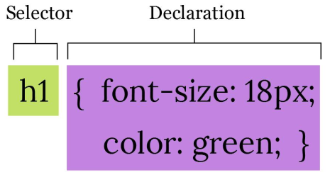
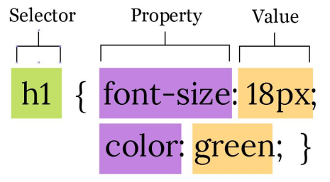

# Modul Kuliah Minggu Ke 1 - Materi CSS
Dosen Pengampu : **Arif Wicaksono Septyanto**

Tujuan :
- Memahami dasar-dasar CSS dalam membangun sebuah Web.

## 1. Aturan Dasar Penulisan CSS
Cascading Style Sheets (CSS) digunakan untuk mengatur tampilan dan gaya elemen-elemen HTML di halaman web. Berikut adalah beberapa aturan dasar penulisan CSS:

Selektor: Selektor adalah elemen HTML yang ingin Anda gayakan. Misalnya, jika Anda ingin mengubah tampilan semua paragraf di halaman, maka ``<p>`` adalah selektornya.

Properti: Properti adalah atribut gaya yang ingin Anda terapkan pada elemen terpilih. Misalnya, untuk mengubah warna teks, properti yang digunakan adalah color.

Nilai Properti: Setiap properti memiliki nilai yang dapat Anda atur. Misalnya, untuk properti color, nilai bisa berupa nama warna (seperti "red" atau "blue") atau kode warna (seperti "#FF0000" untuk merah).

Deklarasi: Deklarasi adalah kombinasi dari properti dan nilai yang diterapkan pada selektor. Deklarasi ini ditempatkan di dalam blok gaya yang diapit oleh tanda kurung kurawal {}.

Contoh aturan dasar penulisan CSS:

```css
/* Selektor: Mengubah semua paragraf */
p {
  color: blue;
  font-size: 16px;
  margin: 10px;
}

/* Selektor: Mengubah elemen dengan class "highlight" */
.highlight {
  background-color: yellow;
  border: 1px solid black;
}

/* Selektor: Mengubah elemen dengan id "header" */
#header {
  text-align: center;
  font-size: 24px;
}
```
Dalam contoh di atas, Anda melihat penggunaan selektor seperti p, .highlight, dan #header. Setiap selektor diikuti oleh blok deklarasi yang berisi properti dan nilai yang ingin Anda terapkan pada elemen yang dipilih.

Beberapa aturan dasar tambahan yang perlu diingat:

1. Spasi dan Indentasi: Gunakan spasi atau tab untuk mengindentasi kode agar lebih mudah dibaca. Ini tidak mempengaruhi tampilan tetapi membuat kode lebih terstruktur.
2. Komentar: Anda dapat menambahkan komentar di CSS dengan menggunakan tanda /* komentar */. Komentar ini akan diabaikan oleh browser dan hanya berfungsi untuk keperluan dokumentasi.
3. Case Sensitivity: CSS bersifat case-insensitive untuk nama elemen dan atribut, tetapi case-sensitive untuk nama kelas, id, serta nama properti dan nilai.
4. Kaskade: Jika ada beberapa aturan CSS yang diterapkan pada elemen yang sama, maka aturan yang lebih spesifik atau yang terakhir dideklarasikan akan digunakan.
5. Unit: Nilai-nilai seperti ukuran font atau lebar harus diberikan dalam unit yang sesuai seperti px, em, rem, %, dll.

Ini hanya gambaran umum tentang aturan dasar penulisan CSS. Saat Anda memahami lebih banyak konsep dan fitur CSS, Anda dapat membuat gaya yang lebih kompleks dan sesuai dengan desain yang diinginkan.

<div align="center">
  
</div>

<div align="center">
  
</div>

## 2. CSS Selector
CSS Selector adalah cara untuk memilih dan menargetkan elemen-elemen HTML tertentu pada halaman web sehingga Anda dapat menerapkan gaya atau aturan tertentu pada elemen-elemen tersebut. Selektor ini berperan penting dalam mendefinisikan bagaimana elemen-elemen HTML akan ditampilkan di halaman web.

Berikut adalah beberapa poin penting terkait CSS Selector:

1. Type Selector:
Menggunakan jenis elemen sebagai selektor.

Contoh:

```css
p {
    color: blue;
}
```
Ini akan menerapkan warna teks biru pada semua elemen ``<p>`` di halaman.

2. Class Selector:
Menggunakan atribut class sebagai selektor.

Contoh HTML:
```css
<p class="highlight">This is a highlighted paragraph.</p>
```
contoh css
```css
.highlight {
    background-color: yellow;
}
```
Ini akan memberikan latar belakang warna kuning pada semua elemen dengan class "highlight".

3. ID Selector:
Menggunakan atribut ID sebagai selektor.

Contoh HTML:
```css
<h1 id="main-heading">Welcome to our website</h1>
```
Contoh CSS:

```css
#main-heading {
    font-size: 24px;
}
```
Ini akan mengubah ukuran font menjadi 24px pada elemen dengan ID "main-heading".

4. Descendant Selector:
Memilih elemen yang merupakan turunan dari elemen lain.

Contoh HTML:
```css
<ul>
    <li>Item 1</li>
    <li>Item 2</li>
</ul>
```
Contoh CSS:
```css
ul li {
    list-style-type: square;
}
```
Ini akan mengubah jenis bullet pada elemen ```<li>``` yang berada dalam elemen ``<ul>``.

5. Pseudo-classes:
Menggunakan keadaan atau interaksi untuk memilih elemen.

Contoh:

```css
a:hover {
    color: red;
}
```
Ini akan mengubah warna teks menjadi merah saat pengguna mengarahkan kursor pada tautan.

6. Child Selector:
Memilih elemen yang merupakan anak langsung dari elemen lain.

Contoh HTML:
```html
<div>
    <p>Paragraph 1</p>
    <p>Paragraph 2</p>
</div>
```
Contoh CSS:
```css
div > p {
    font-style: italic;
}
```
Ini akan miringkan (italic) semua elemen ``<p>`` yang merupakan anak langsung dari elemen ``<div>``.

7. Attribute Selector:
Memilih elemen berdasarkan atribut tertentu.

Contoh HTML:
```html
<input type="submit" value="Submit">
<input type="text" placeholder="Enter your name">
```
Contoh CSS:

```css
[type="submit"] {
    background-color: green;
}

```
Ini akan memberikan latar belakang warna hijau pada elemen dengan atribut type="submit".

8. Grouping Selector:
Menggabungkan beberapa selektor menjadi satu aturan.

Contoh:
```css
h1, h2, h3 {
    color: purple;
}
```
Ini akan memberikan warna ungu pada semua elemen ```<h1>```, ``<h2>``, dan ```<h3>```.

Semua contoh di atas menggambarkan cara CSS Selector digunakan untuk memilih elemen-elemen tertentu pada halaman web dan menerapkan gaya atau aturan tertentu pada elemen-elemen tersebut.

## 3. Cascade, Inheritance dan Specificity
Cascade, Inheritance, dan Specificity adalah tiga konsep fundamental dalam CSS yang membantu dalam memahami bagaimana aturan-aturan gaya diterapkan pada elemen-elemen dalam halaman web. Mari jelaskan ketiga konsep tersebut lebih detail:

1. Cascade:
Cascade (urutan aplikasi aturan) mengacu pada cara CSS menangani konflik ketika ada aturan yang bertentangan atau tumpang tindih pada elemen yang sama. Urutan cascade ini penting untuk menentukan gaya mana yang akan diterapkan pada elemen tertentu.

Aturan cascade berjalan dalam tiga tingkatan:

   - Inline Styles: Gaya yang dideklarasikan secara langsung dalam atribut style pada elemen.
   - Internal Stylesheet: Gaya yang dideklarasikan dalam elemen ```<style> ```di dalam dokumen HTML.
   - External Stylesheet: Gaya yang dideklarasikan dalam file terpisah (CSS eksternal) yang dihubungkan dengan elemen ``<link>``.
Ketika ada konflik, aturan yang memiliki tingkat cascade yang lebih tinggi akan mengatasi aturan yang memiliki tingkat lebih rendah. Misalnya, gaya dalam inline styles akan memiliki prioritas lebih tinggi daripada gaya dalam internal atau external stylesheet.

2. Inheritance:
Inheritance (pewarisan) merujuk pada konsep di mana beberapa properti gaya dari elemen anak dapat diwarisi dari elemen induknya. Ini memungkinkan elemen anak mengambil beberapa properti gaya dari elemen induk tanpa harus mendeklarasikan ulang.

Properti-properti seperti font-family, color, dan text-align cenderung diwarisi oleh elemen anak dari elemen induknya. Namun, properti seperti border dan width biasanya tidak diwarisi.

3. Specificity:
Specificity (kekhuan) mengukur sejauh mana sebuah selektor memiliki kekhususan dalam memilih elemen. Ketika ada konflik antara beberapa aturan yang berlaku pada elemen yang sama, specificity digunakan untuk menentukan aturan mana yang akan diterapkan.

Specificity diukur dalam nilai numerik yang terkait dengan jenis selektor dan penggunaan selektor tertentu (kelas, ID, elemen). Semakin tinggi nilai specificity, semakin kuat selektor tersebut.

Contoh tingkatan specificity:

- Inline styles memiliki nilai specificity tertinggi.
- ID selectors memiliki nilai lebih tinggi daripada class selectors atau type selectors.
- Pseudo-class selectors memiliki nilai lebih rendah daripada class selectors.
- Universal selectors memiliki nilai sangat rendah.

Menggabungkan pemahaman tentang Cascade, Inheritance, dan Specificity membantu dalam mengelola bagaimana gaya diterapkan pada elemen-elemen dalam halaman web dan mengatasi potensi konflik atau tumpang tindih aturan gaya.

contoh untuk setiap konsep tersebut:

1. Cascade:
HTML:
```html
<p class="red-text">This is a paragraph with a class.</p>
```
CSS (inline styles):

```css
<p style="color: blue;">This paragraph has inline styles.</p>
```

CSS (internal stylesheet):

```css
<style>
  p {
    color: green;
  }
</style>
```
CSS (external stylesheet):

```css
p {
  color: red;
}
```
Dalam contoh ini, meskipun ada beberapa aturan yang mempengaruhi elemen ``<p>``, aturan yang diaplikasikan akan bergantung pada urutan cascade. Aturan dari inline styles akan memiliki prioritas tertinggi, diikuti oleh aturan dalam internal stylesheet dan external stylesheet.

2. Inheritance:

HTML:
```html
<div class="parent">
  <p>This is a paragraph inside a parent div.</p>
</div>
```
CSS:

```css
.parent {
  font-family: Arial, sans-serif;
  color: blue;
}
```

Dalam contoh ini, elemen paragraf (``<p>``) akan mewarisi properti font-family dan color dari elemen induk (``<div class="parent">``). Itu berarti paragraf akan menggunakan font dan warna yang sama dengan div induknya.

3. Specificity:
HTML:
```html
<p class="special" id="unique">This is a specific paragraph.</p>
```
CSS:
```css
p {
  color: red;
}

.special {
  color: blue;
}

#unique {
  color: green;
}
```
Dalam contoh ini, meskipun semuanya adalah elemen paragraf (``<p>``), properti color yang akan diterapkan pada elemen tersebut akan bergantung pada nilai specificity dari selektor. Selektor #unique memiliki specificity tertinggi, sehingga warna hijau akan diterapkan pada paragraf tersebut, meskipun ada aturan lain yang juga mempengaruhinya.


## 4. CSS Typography
CSS Typography adalah bagian penting dari desain web yang berkaitan dengan tampilan dan pengaturan teks pada halaman web. Ini melibatkan penggunaan properti gaya untuk mengontrol jenis huruf, ukuran, warna, jarak, dan tata letak teks agar konten menjadi lebih mudah dibaca dan menarik bagi pengguna. Berikut ini beberapa properti dan konsep yang terkait dengan CSS Typography:

1. Font Family:
Properti ini mengatur jenis huruf yang akan digunakan untuk teks. Anda dapat menentukan beberapa jenis huruf sebagai alternatif jika jenis huruf pertama tidak tersedia di komputer pengguna.

Contoh:
```css
body {
    font-family: "Helvetica Neue", Arial, sans-serif;
}
```
2. Font Size:
Properti ini mengatur ukuran huruf teks. Ukuran biasanya dinyatakan dalam piksel (px), em, atau rem.

Contoh:
```css
p {
    font-size: 16px;
}
```

3. Font Weight:
Properti ini mengatur tebal tipografi. Anda dapat menggunakan nilai seperti normal, bold, atau angka numerik seperti 400 atau 700.

Contoh:
```css
h1 {
    font-weight: bold;
}
```

4. Font Style:
Properti ini mengatur gaya tipografi seperti miring (italic).

Contoh:
```css
em {
    font-style: italic;
}
```
5. Text Color:
Properti ini mengatur warna teks.

Contoh:
```css
h2 {
    color: #333333;
}
```
6. Text Alignment:
Properti ini mengatur penyejajaran teks, seperti rata kanan, rata kiri, rata tengah, atau rata kanan-kiri (justify).

Contoh:
```css
p {
    text-align: center;
}
```

7. Line Height:
Properti ini mengatur jarak antara baris dalam teks, sehingga mempengaruhi keterbacaan dan tata letak teks.

Contoh:
```css
p {
    line-height: 1.5;
}
```

8. Letter Spacing:
Properti ini mengatur jarak antara huruf dalam kata.

Contoh:

```css
h3 {
    letter-spacing: 1px;
}
```

9. Text Decoration:
Properti ini mengatur dekorasi teks seperti garis bawah (underline) atau garis tengah (line-through) untuk tautan atau teks terpilih.

Contoh:

```css
a {
    text-decoration: none;
}
```

10. Text Transform:
Properti ini mengatur perubahan gaya huruf dalam teks, seperti mengubah teks menjadi huruf kapital (uppercase) atau huruf kecil (lowercase).

Contoh:

```css
.uppercase {
    text-transform: uppercase;
}
  ```

CSS Typography membantu dalam menciptakan tampilan teks yang lebih menarik, mudah dibaca, dan sesuai dengan desain keseluruhan dari halaman web Anda.


## 5. CSS Box Model

## 6. CSS Background

## 7. CSS Positioning

## 8. CSS3 Multiple Column

## 9. CSS3 Border Image & Box Shadow

## 10. CSS Case Study

## 11. Perancangan Layout