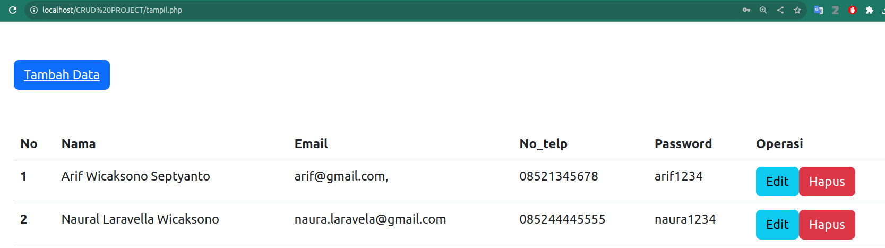
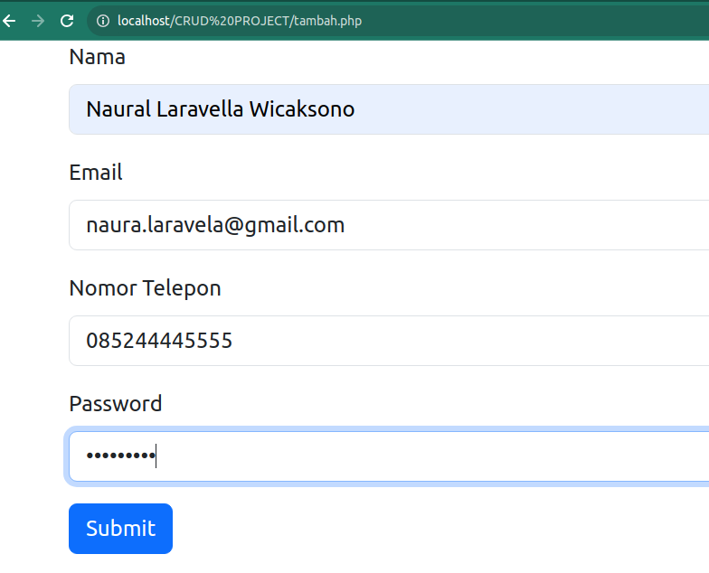
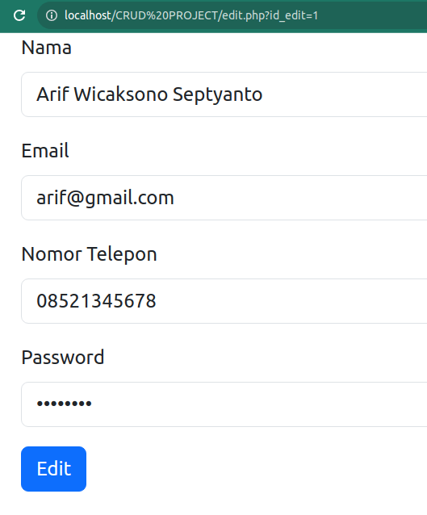
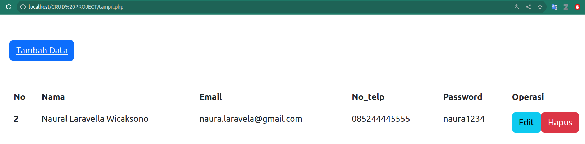

# Modul Kuliah Minggu Ke 6 & 7 - Materi PHP Lanjutan
Dosen Pengampu : **Arif Wicaksono Septyanto**

Tujuan :
- Mampu membuat operasi CRUD dalam aplikasi berbasis Web


**Contoh Membuat Aplikasi CRUD Menggunakan Bootstrap 5**

**1. Generate Database**
```php
<?php
  // buat koneksi dengan database mysql
  $dbhost = "localhost";
  $dbuser = "admin";
  $dbpass = "admin";
  $link   = mysqli_connect($dbhost,$dbuser,$dbpass);

  //periksa koneksi, tampilkan pesan kesalahan jika gagal
  if(!$link){
    die ("Koneksi gagal: ".mysqli_connect_errno().
         " - ".mysqli_connect_error());
  }

  //buat database mahasiswa jika belum ada
  $query = "CREATE DATABASE IF NOT EXISTS crud";
  $result = mysqli_query($link, $query);

  if(!$result){
    die ("Query Error: ".mysqli_errno($link).
         " - ".mysqli_error($link));
  }
  else {
    echo "Database <b>'CRUD'</b> berhasil dibuat... <br>";
  }

  //pilih database kampusku
  $result = mysqli_select_db($link, "crud");

  if(!$result){
    die ("Query Error: ".mysqli_errno($link).
         " - ".mysqli_error($link));
  }
  else {
    echo "Database <b>'CRUD'</b> berhasil dipilih... <br>";
  }

  // cek apakah tabel mahasiswa sudah ada. jika ada, hapus tabel
  $query = "DROP TABLE IF EXISTS tb_crud";
  $hasil_query = mysqli_query($link, $query);

  if(!$hasil_query){
    die ("Query Error: ".mysqli_errno($link).
         " - ".mysqli_error($link));
  }
  else {
    echo "Tabel <b>'tb_crud'</b> berhasil dihapus... <br>";
  }

  // buat query untuk CREATE tabel mahasiswa
  $query  = "CREATE TABLE tb_crud (id INT(11) NOT NULL AUTO_INCREMENT, nama VARCHAR(100), ";
  $query .= "email VARCHAR(100), no_telp VARCHAR(20), password VARCHAR(50),";
  $query .= "PRIMARY KEY (id))";

  $hasil_query = mysqli_query($link, $query);

  if(!$hasil_query){
      die ("Query Error: ".mysqli_errno($link).
           " - ".mysqli_error($link));
  }
  else {
    echo "Tabel <b>'tb_crud'</b> berhasil dibuat... <br>";
  }

  // buat query untuk INSERT data ke tabel mahasiswa
  $query  = "INSERT INTO tb_crud VALUES ";
  $query .= "('1','Arif Wicaksono Septyanto', 'arif@gmail.com,', '08521345678', ";
  $query .= "'arif1234')";
 
  $hasil_query = mysqli_query($link, $query);

  if(!$hasil_query){
      die ("Query Error: ".mysqli_errno($link).
           " - ".mysqli_error($link));
  }
  else {
    echo "Tabel <b>'tb_crud'</b> berhasil diisi... <br>";
  }

  mysqli_close($link);
?>
```

<div align="center">
  
</div>

**Youtube**
[CRUD PHP#01 : Review Program dan Generate Database Dari PHP](https://youtu.be/IudyJRID0wQ?si=kMFNstYLh_fg40pm)


**2. Koneksi Database**
```php
<?php

$dbhost = "localhost";
$dbuser = "admin";
$dbpass = "admin";
$dbname = "crud";
$link = mysqli_connect($dbhost, $dbuser, $dbpass, $dbname);
if(!$link){
    die ("koneksi dengan database gagal : ".mysqli_connect_errno().
    " - ".mysqli_connect_error());
}
?>
```

**3. Tampil / Halaman Utama**
```php
<?php

include("connection.php");

?>

<!DOCTYPE html>
<html lang="en">

<head>
    <meta charset="UTF-8">
    <meta http-equiv="X-UA-Compatible" content="IE=edge">
    <meta name="viewport" content="width=device-width, initial-scale=1.0">
    <title>Halaman tampil</title>
    <link href="https://cdn.jsdelivr.net/npm/bootstrap@5.3.0-alpha1/dist/css/bootstrap.min.css" rel="stylesheet" integrity="sha384-GLhlTQ8iRABdZLl6O3oVMWSktQOp6b7In1Zl3/Jr59b6EGGoI1aFkw7cmDA6j6gD" crossorigin="anonymous">
</head>

<body>
    <div class="container">
    <button class="btn btn-primary my-5">
        <a href="tambah.php" class="text-light">Tambah Data</a>
    </button>
        <table class="table">
            <thead>
                <tr>
                    <th scope="col">No</th>
                    <th scope="col">Nama</th>
                    <th scope="col">Email</th>
                    <th scope="col">No_telp</th>
                    <th scope="col">Password</th>
                    <th scope="col">Operasi</th>
                </tr>
            </thead>
            <tbody>
                <?php

                    $query = "SELECT * FROM tb_crud";
                    $result = mysqli_query($link, $query);
                    if(!$result){
                        die ("Query Error : ".mysqli_errno($link).
                        " - ".mysqli_error($link));
                    }

                    while($data = mysqli_fetch_assoc($result)){
                        echo "<tr>";
                        echo "<th>$data[id]</th>";
                        echo "<td>$data[nama]</td>";
                        echo "<td>$data[email]</td>";
                        echo "<td>$data[no_telp]</td>";
                        echo "<td>$data[password]</td>";
                        echo "<td>";
                        echo "<a href=\"edit.php?id_edit=$data[id]\" class=\"btn btn-info\">Edit</a>";
                        echo "<a href=\"hapus.php?id_hapus=$data[id]\" class=\"btn btn-danger\">Hapus</a>";
                        echo "</td>";
                        echo "</tr>";
                    }

                ?>
  
            </tbody>
        </table>

    </div>
</body>

</html>
```
<div align="center">
  
</div>


**Youtube**
[CRUD PHP#03 : Menampilkan Data](https://youtu.be/Gos2yaFArBs?si=FPvBMnoG72_GZ_7h)

**4. Tambah Data**
```php
<?php

include("connection.php");

if(isset($_POST['submit'])){

        // echo "<pre>";
        // print_r($_POST);
        // echo "</pre>";

    $nama = $_POST['nama'];
    $email = $_POST['email'];
    $telepon = $_POST['no_tlp'];
    $password = $_POST['password'];

    $query = "INSERT INTO tb_crud (nama, email, no_telp, password) VALUES ";
    $query .= "('$nama', '$email', '$telepon', '$password')";
    $result = mysqli_query($link, $query);
    if(!$result){
        die ("Query Error : ".mysqli_errno($link).
        " - ".mysqli_error($link));
    }
    else{
        // echo "Tabel 'tb_crud' berhasil ditambah..";
        header('Location: tampil.php');
    }

}


?>
<!doctype html>
<html lang="en">

<head>
    <meta charset="utf-8">
    <meta name="viewport" content="width=device-width, initial-scale=1">
    <title>Bootstrap demo</title>
    <link href="https://cdn.jsdelivr.net/npm/bootstrap@5.3.0-alpha1/dist/css/bootstrap.min.css" rel="stylesheet" integrity="sha384-GLhlTQ8iRABdZLl6O3oVMWSktQOp6b7In1Zl3/Jr59b6EGGoI1aFkw7cmDA6j6gD" crossorigin="anonymous">
</head>

<body>
    <div class="container">

        <form action="tambah.php" method="POST">
            <div class="mb-3">
                <label for="exampleInputNama1" class="form-label">Nama</label>
                <input type="text" name="nama" class="form-control" id="exampleInputNama1"
                placeholder="Enter Your Name">
            </div>
            <div class="mb-3">
                <label for="exampleInputEmail1" class="form-label">Email</label>
                <input type="email" name="email" class="form-control" id="exampleInputEmail1"
                placeholder="Enter Your Email">
            </div>
            <div class="mb-3">
                <label for="exampleInputTlp1" class="form-label">Nomor Telepon</label>
                <input type="text" name="no_tlp" class="form-control" id="exampleInputTlp1"
                placeholder="Enter Your Number Telepon">
            </div>
            <div class="mb-3">
                <label for="exampleInputPass1" class="form-label">Password</label>
                <input type="password" name="password" class="form-control" id="exampleInputPass1"
                placeholder="Enter Your Password">
            </div>
            <button type="submit" name="submit" class="btn btn-primary">Submit</button>
        </form>

    </div>
</body>

</html>
```

<div align="center">
  
</div>

**Youtube**
[CRUD PHP#02 : Tambah Data](https://youtu.be/RszC1O9qnXQ?si=yjYBhHSy7RMUOjqL)

**5. Edit data**
```php
<?php

include("connection.php");

if(isset($_POST['edit'])){

        // echo "<pre>";
        // print_r($_POST);
        // echo "</pre>";
    $id = $_POST['id'];
    $nama = $_POST['nama'];
    $email = $_POST['email'];
    $telepon = $_POST['no_tlp'];
    $password = $_POST['password'];


    $query = "UPDATE tb_crud SET ";
    $query .= "nama = '$nama', email = '$email', no_telp = '$telepon',";
    $query .= "password = '$password' WHERE id = '$id'";
    $result = mysqli_query($link, $query);
    if(!$result){
        die ("Query Error : ".mysqli_errno($link).
        " - ".mysqli_error($link));
    }
    else{
        //echo "Tabel 'tb_crud' berhasil diedit..";
        header('Location: tampil.php');
    }

}

?>

<?php

$id = $_GET['id_edit'];
$query = "SELECT * FROM tb_crud WHERE id=$id";
$result = mysqli_query($link, $query);
$row = mysqli_fetch_assoc($result);
$nama = $row['nama'];
$email = $row['email'];
$telepon = $row['no_telp'];
$password = $row['password'];

?>

<!doctype html>
<html lang="en">

<head>
    <meta charset="utf-8">
    <meta name="viewport" content="width=device-width, initial-scale=1">
    <title>Bootstrap demo</title>
    <link href="https://cdn.jsdelivr.net/npm/bootstrap@5.3.0-alpha1/dist/css/bootstrap.min.css" rel="stylesheet" integrity="sha384-GLhlTQ8iRABdZLl6O3oVMWSktQOp6b7In1Zl3/Jr59b6EGGoI1aFkw7cmDA6j6gD" crossorigin="anonymous">
</head>

<body>
    <div class="container">

        <form action="edit.php" method="POST">
            <div class="mb-3">
                <label for="exampleInputNama1" class="form-label">Nama</label>
                <input type="text" name="nama" class="form-control" id="exampleInputNama1"
                placeholder="Enter Your Name" value="<?php echo $nama ?>">
            </div>
            <div class="mb-3">
                <label for="exampleInputEmail1" class="form-label">Email</label>
                <input type="email" name="email" class="form-control" id="exampleInputEmail1"
                placeholder="Enter Your Email" value="<?php echo $email ?>">
            </div>
            <div class="mb-3">
                <label for="exampleInputTlp1" class="form-label">Nomor Telepon</label>
                <input type="text" name="no_tlp" class="form-control" id="exampleInputTlp1"
                placeholder="Enter Your Number Telepon" value="<?php echo $telepon ?>">
            </div>
            <div class="mb-3">
                <label for="exampleInputPass1" class="form-label">Password</label>
                <input type="password" name="password" class="form-control" id="exampleInputPass1"
                placeholder="Enter Your Password" value="<?php echo $password ?>">
            </div>
            <td><input type="hidden" name="id" value="<?php echo $_GET['id_edit']; ?>"></td>
            <button type="submit" name="edit" class="btn btn-primary">Edit</button>
        </form>

    </div>
</body>

</html>
```

<div align="center">
  
</div>

**Youtube**
[CRUD PHP#05 : Update Data FINAL @codelearnid](https://youtu.be/HXjbH2Ip5mE?si=zE32qy3e7ievRYhe)

**6. Hapus Data**
```php
<?php
include("connection.php");

if(isset($_GET['id_hapus'])){
    $id_hapus = $_GET['id_hapus'];

    $query = "DELETE FROM tb_crud WHERE id=$id_hapus";
    $result = mysqli_query($link, $query);
    if(!$result){
        die ("Query Error : ".mysqli_errno($link).
        " - ".mysqli_error($link));
    }
    else{
        // echo "Data tb_crud berhasil dihapus";
        header('Location: tampil.php');
    }
}

?>
```
<div align="center">
  
</div>

**Youtube**
[CRUD PHP#04 : Delete Data](https://youtu.be/UrVQ9BTut_M?si=FdFsiMvn452yecPV)